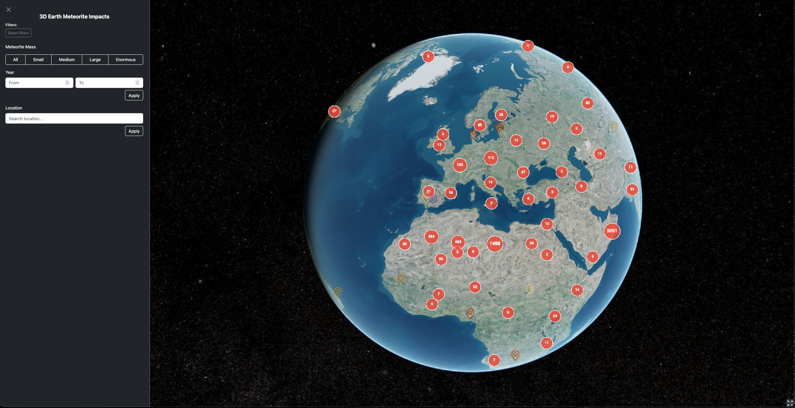
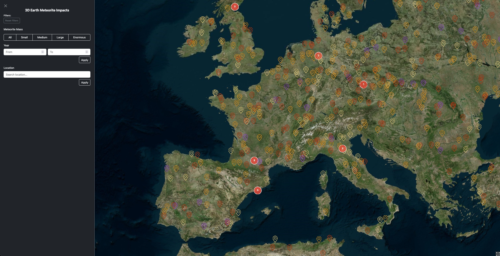
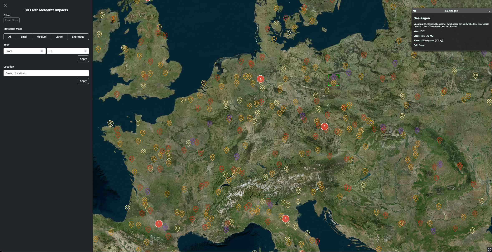

# 3D Earth Meteorite Impacts

An interactive 3D globe visualizing ~45,000 meteorite impact sites from NASA's Meteorite Landings dataset. Filter by mass, year, and location — click any marker to see reverse-geocoded location data.

## Technologies used:


## Live demo

> Link coming soon (deploying on Render)


## Pictures




## Features

- 3D globe with color-coded markers by meteorite mass
- Dynamic clustering based on zoom level
- Filter by mass category, year range, and location name
- Reverse geocoding on marker click via Nominatim (OpenStreetMap)
- Resizable and toggleable sidebar
- Falls back to local backup if NASA API is unavailable

## Tech stack

| Layer | Technology |
|---|---|
| 3D Globe | [CesiumJS](https://cesium.com/) |
| Runtime | Node.js |
| Language | JavaScript (ES modules) |
| Frontend bundler | [Vite](https://vitejs.dev/) |
| Backend | [Express](https://expressjs.com/) |
| UI | [Bootstrap 5](https://getbootstrap.com/) |
| Geocoding | [Nominatim](https://nominatim.org/) (OpenStreetMap) |
| Testing | [Vitest](https://vitest.dev/) |
| Containerization | Docker |
| Web server | Caddy |
| Data | [NASA Meteorite Landings API](https://data.nasa.gov/resource/gh4g-9sfh.json) |

## Getting started

```bash
git clone https://github.com/FelixJrB/3d-meteorite-impacts.git
cd 3d-meteorite-impacts
npm install
```

Create a `.env` file in the project root:

```
VITE_CESIUM_TOKEN=your_cesium_ion_token
```

```bash
npm run dev      # start development server
npm test         # run unit tests
npm run build    # production build
```

## Folder structure

```
3D-meteorite-impacts/
├── index.html
├── server.js
└── src/
    ├── main.js
    ├── api/
    │   ├── meteorites.js
    │   └── nominatim.js
    ├── cesiumjs/
    │   ├── markers.js
    │   └── viewer.js
    ├── styles/
    │   └── cesiumContainer.css
    └── utils/
        └── filterMeteorites.js
```